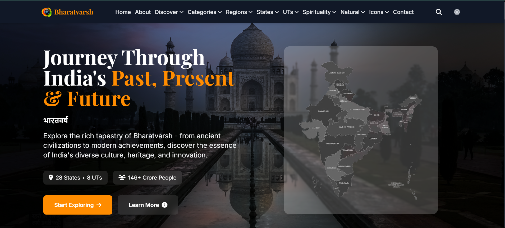

# Bharatvarsh — Journey Through India's Past, Present & Future

> *"Celebrating the timeless spirit of India"* — A comprehensive digital encyclopedia of India's 5000+ year civilization, heritage, culture, and identity.

[](https://developer.mozilla.org/en-US/docs/Web/HTML)
[](https://developer.mozilla.org/en-US/docs/Web/CSS)
[](https://developer.mozilla.org/en-US/docs/Web/JavaScript)
[](https://tailwindcss.com)
[](LICENSE)
[](#project-structure)



**Bharatvarsh** is India's most comprehensive digital heritage portal — an immersive, beautifully designed web encyclopedia covering every state, union territory, historical era, spiritual tradition, and cultural dimension of Indian civilization. Built with pure HTML, Tailwind CSS, and Vanilla JavaScript, with zero frameworks and zero dependencies to install.

---

## Features

### Explore India
- **28 State Pages** — Dedicated pages for every Indian state with culture, history, geography & highlights
- **8 Union Territory Pages** — Complete coverage of all UTs including Delhi, Chandigarh & Puducherry
- **6 Regional Sections** — North, South, East, West, Central & Northeast India deep-dives
- **Interactive Site-wide Search** — Real-time debounced search with category filtering across all 102 pages

### Heritage & Culture
- **5 Personality Galleries** — Freedom fighters, historical rulers, Presidents, Prime Ministers & notable Indians
- **7 Spirituality Pages** — Hinduism, Buddhism, Jainism, Sikhism, sacred places & spiritual practices
- **6 Natural Heritage Pages** — National parks, wildlife sanctuaries, mountain ranges, coastal areas & natural wonders
- **17 Thematic Categories** — Geography, arts, cuisine, science, sports, education, languages, crafts & more
- **18 Discovery Topics** — Ancient period, medieval empires, colonial era, independence movement, modern India & more

### User Experience
- **Dark / Light Mode** — Smooth theme switching with `localStorage` persistence and system preference detection
- **Fully Responsive** — Mobile-first design that works across all screen sizes and devices
- **Mega Navigation Menus** — Organised hover menus with full mobile dropdown support
- **Reusable Component System** — Dynamic navbar & footer loaded across all 102 pages via JavaScript
- **Performance Monitoring** — Built-in load tracking and lazy initialisation
- **WCAG 2.1 AA Accessible** — Semantic HTML with ARIA labels and full keyboard navigation

---

## Project Structure

```
Bharatvarsh/
│
├── index.html                        # Homepage — hero, categories, discover
├── about.html                        # Mission, vision & team
├── contact.html                      # Contact form
│
├── components/
│   ├── navbar.html                   # Shared navigation with mega menus
│   └── footer.html                   # Shared site footer
│
├── assets/
│   ├── js/
│   │   ├── main.js                   # Theme, search, scroll & mobile menu
│   │   ├── components.js             # Dynamic component loading system
│   │   ├── contact.js                # Contact form handling
│   │   └── performance.js            # Performance monitoring
│   ├── css/
│   │   └── styles.css                # Custom animations & overrides
│   └── img/                          # Banners, maps & core images
│
├── states/                           # 28 Indian state pages
│   ├── kerala.html
│   ├── rajasthan.html
│   └── ...
│
├── uts/                              # 8 Union territory pages
│   ├── delhi.html
│   ├── chandigarh.html
│   └── ...
│
├── regions/                          # 6 Regional pages
│   ├── north_india.html
│   ├── south_india.html
│   └── ...
│
├── icons/                            # 5 Personality galleries
│   ├── freedom_fighters.html
│   ├── prime_ministers.html
│   └── ...
│
├── spirituality/                     # 7 Spirituality pages
│   ├── hinduism.html
│   ├── buddhism.html
│   └── ...
│
├── natural/                          # 6 Natural heritage pages
│   ├── national_parks.html
│   ├── mountain_ranges.html
│   └── ...
│
├── categories/                       # 17 Thematic category pages
│   ├── geography.html
│   ├── cuisine.html
│   └── ...
│
├── discover/                         # 18 Discovery topic pages
│   ├── ancient_period.html
│   ├── independence_movement.html
│   └── ...
│
└── data/
    ├── categories.json               # Category metadata
    ├── discover.json                 # Discovery topic metadata
    └── updates.json                  # Latest site updates
```

---

## Tech Stack

| Layer | Technology |
|---|---|
| Markup | HTML5 (semantic, accessible) |
| Styling | Tailwind CSS v3.4+ (CDN) + Custom CSS |
| Logic | Vanilla JavaScript ES6+ |
| Icons | Font Awesome (CDN) |
| Typography | Playfair Display (headings) · Inter (body) |
| Data | JSON (categories, discover, updates) |
| Hosting | Static — any web server or CDN |

---

## Getting Started

> **Important:** Bharatvarsh uses a component system that requires a local web server. Opening `index.html` directly via `file://` will not load the shared navbar and footer due to browser CORS restrictions.

### 1. Clone the repository

```bash
git clone https://github.com/Prash-Mayank/Bharatvarsh.git
cd Bharatvarsh
```

### 2. Start a local server

```bash
# Python 3 (recommended)
python -m http.server 8000

# Node.js
npx http-server

# PHP
php -S localhost:8000
```

### 3. Open in browser

```
http://localhost:8000
```

---

## Development Roadmap

- [x] Phase 1 — Foundation, branding & design system
- [x] Phase 2 — Core UI components & navigation
- [x] Phase 3 — Homepage & search
- [x] Phase 4 — Geographic coverage (28 states + 8 UTs + 6 regions)
- [x] Phase 5 — Heritage modules (icons, spirituality, natural heritage)
- [x] Phase 6 — Component system & dynamic loading
- [x] Phase 7 — All 35 category & discovery pages created
- [x] Phase 8 — Icon standardisation (Font Awesome across all 102 pages)
- [ ] Phase 9 — Content depth & manual review (0 / 102 reviewed)
- [ ] Phase 10 — Visual assets & image integration
- [ ] Phase 11 — Performance & SEO optimisation
- [ ] Phase 12 — Multi-language support (Hindi + regional languages)
- [ ] Phase 13 — Progressive Web App (PWA)
- [ ] Phase 14 — Interactive India map with clickable states

---

## Contributing

Contributions are welcome — especially for content enhancement and visual assets!

1. Fork the repository
2. Create your feature branch (`git checkout -b feature/your-feature`)
3. Commit your changes (`git commit -m 'Add your feature'`)
4. Push to the branch (`git push origin feature/your-feature`)
5. Open a Pull Request

### Priority areas
- Content depth improvement across category & discovery pages
- High-quality images and regional maps
- Interactive features (timelines, galleries, maps)
- Accessibility enhancements
- SEO meta tags and structured data

---

## License

This project is licensed under the **MIT License** — see the [LICENSE](LICENSE) file for details.

---

## Author

**Mayank Prashar**

[](https://github.com/prash-mayank)
[](https://www.linkedin.com/in/prashmayank)
[](mailto:mayank.prash@gmail.com)

---

<p align="center">Built with love for India's rich heritage and digital future</p>
<p align="center">© 2024 Bharatvarsh. All rights reserved.</p>
